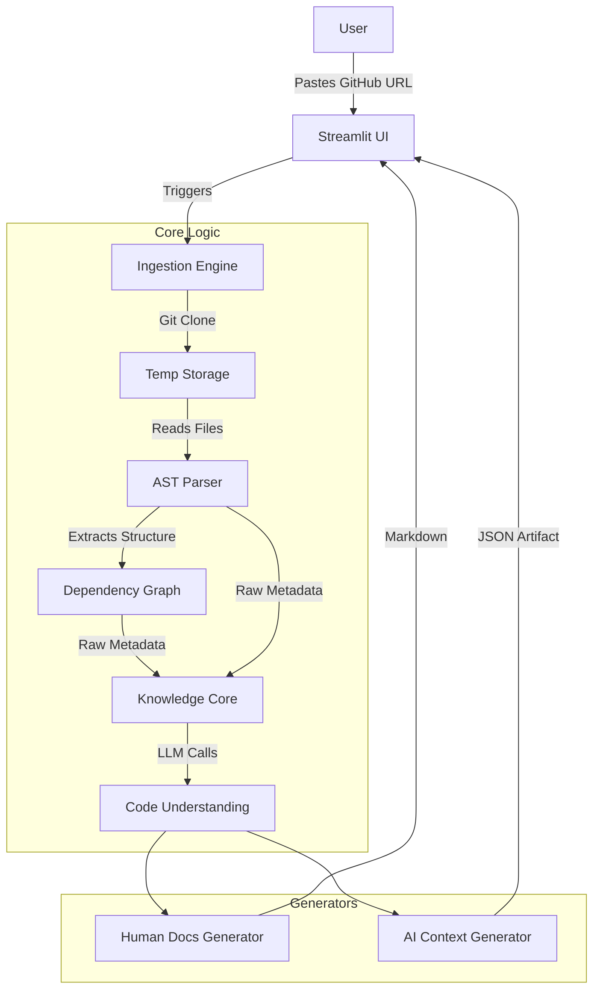

# RepoMentor 🧠📚

<div align="center">
  <h3>AI-Powered Code Comprehension Platform</h3>
  <p>Turn any GitHub Repository into clear Human Documentation & optimized AI Context.</p>

  [](https://opensource.org/licenses/MIT)
  [](https://www.python.org/downloads/)
  [](https://streamlit.io)
</div>

---

## 📖 Overview

**RepoMentor** is a Streamlit-based web application that helps developers and AI agents instantly understand unfamiliar codebases.

Simply paste a **GitHub Repository URL**, and RepoMentor will:
1.  **Clone & Ingest** the codebase securely.
2.  **Analyze** the structure using AST (Abstract Syntax Trees) and dependency graphs.
3.  **Generate** two distinct artifacts:
    *   📚 **Human-Readable Documentation:** Markdown guides, architecture diagrams, and module summaries.
    *   🤖 **AI-Optimized Context:** A compressed JSON representation of the codebase's logic, types, and dependencies, ready to be fed into LLM coding agents.

---

## 🏗 Architecture

The system follows a linear "Ingest → Analyze → Generate" pipeline, wrapped in an interactive web UI.



---

## 🛠 Tech Stack

*   **Frontend / UI:** [Streamlit](https://streamlit.io/) - Interactive web interface.
*   **Core Language:** Python 3.10+
*   **VCS Operations:** `GitPython` - For cloning and managing repositories.
*   **Static Analysis:**
    *   `ast` (Standard Lib) - For parsing Python abstract syntax trees.
    *   `networkx` - For building and analyzing file dependency graphs.
*   **Generative AI:** `litellm` - Interface for OpenAI/Gemini/Anthropic models.
*   **Visualization:** `graphviz` / `streamlit-agraph` - For rendering architecture diagrams.

---

## 🚀 Future Roadmap & Enhancements

*   **Model Context Protocol (MCP) Server:**
    *   Expose the analyzed repository as an **MCP Resource**.
    *   Allow tools like **Claude Desktop** and **Cursor** to directly "subscribe" to RepoMentor's understanding without manual file transfer.
*   **Multi-Language Support:** Expand AST parsing beyond Python (starting with JavaScript/TypeScript).
*   **Vector Search (RAG):** Implement a vector database for semantic code search within the chat interface.
*   **Live Diagramming:** Interactive, zoomable class diagrams generated on the fly.

---

## 📦 Getting Started

*(Coming Soon - currently in active development)*

```bash
# Clone the repo
git clone https://github.com/yourusername/repomentor.git

# Install dependencies
pip install -r requirements.txt

# Run the app
streamlit run app.py
```
